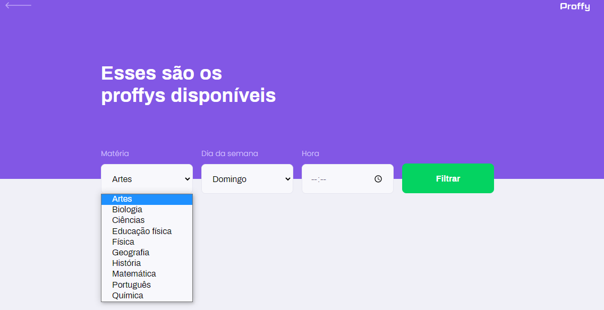
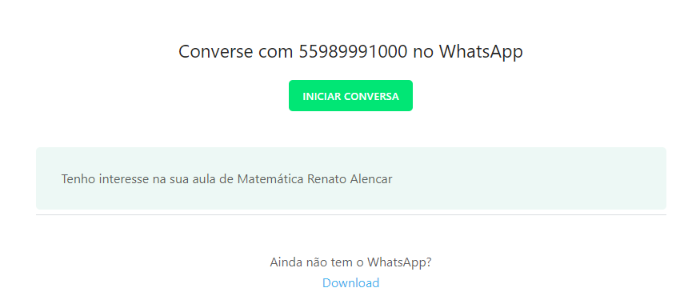
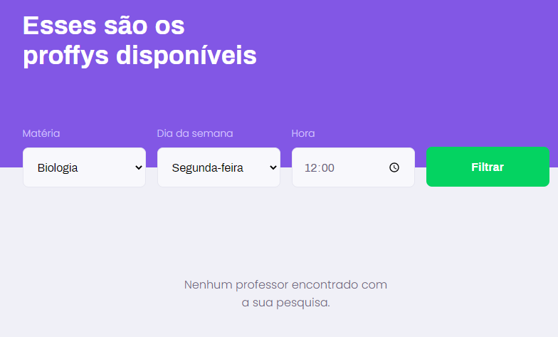
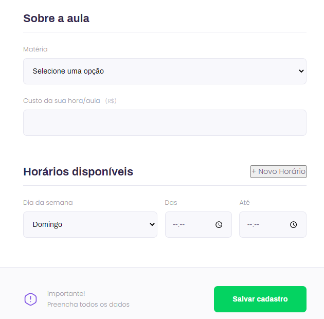

 <h1> Proffy </h1> 

## 🛸Sobre 
O Proffy é um aplicativo de agendamento e pesquisa de aulas online.
Ele foi criado para ensinar e aplicar os conhecimentos sobre programação *web* na parte de *Front-end* e *Back-end* durante a Next Level Week #2 (NLW#2) O evento online foi realizado de 3 até 9 de agosto de 2020 pela [Rocketseat](https://rocketseat.com.br)🚀.

## 🎯**Objetivo**
### 🔭 Ensinar e aplicar os conhecimentos de:
- Linguagem de programação;
- Criação da estrutura funcional e formatação visual da página *web*;
- Instalação de dependências;
- Criação de servidor *web*;
- Inserção, manipulação, persistência e validação e refatoração de dados.

## 🛰️**Tecnologias adotadas**
- Node.js;
- JavaScript;
- HTML;
- CSS;
- NunJucks;
- Lite Server;
- SQLite;

## 📱 **Layout do Aplicativo**
Criação das páginas: Inicial, Estudo e Dar aulas.

### Página Inicial
Define a ideia central do aplicativo e permite que o usuário siga para as páginas **Estudos** e **Dar aulas**. Todas as páginas permitem o retorno a página **Inicial**.

### Página Estudo
Permite ao usuário filtrar os proffys disponíveis de acordo com as matérias, os dias da semana e horário.

Caso tenha encontrado o proffy, o usuário será redirecionado a página de perfil dos proffys.

Ao clicar em **Entrar em contato** o usuário será redirecionado a página de contato com o número de whatsapp.

Caso não encontre nenhum proffy, a página mostrará a mensagem:

### Página Dar aulas
Permite que o usuário cadastre: os seus dados, o preço da aula, a matéria e o horário das aulas, além de adicionar mais horários disponíveis.

Depois disso, o usuário será redirecionado novamente para a página de perfil dos proffys.

